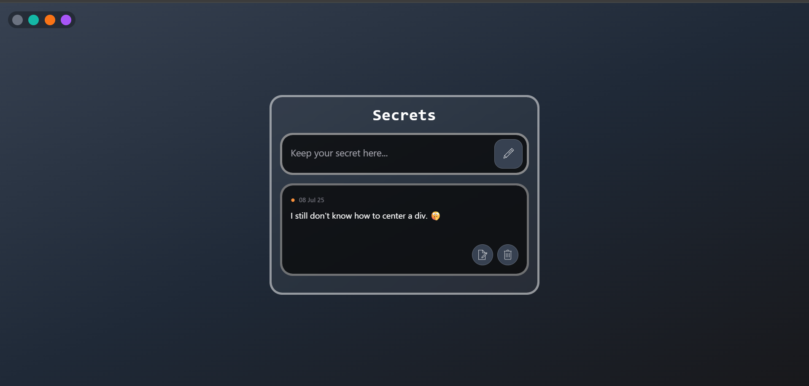

# ✨ Secret Quotes App

A sleek and aesthetic quotes/secrets app built with **React + Tailwind CSS**, featuring:

- 🧊 Glassmorphic UI
- 🖊️ Animated icons using [Lordicon](https://lordicon.com/)
- 🎨 Dynamic gradient background switcher
- 🧠 LocalStorage-based quote saving & editing

---

## 🚀 Features

- ✅ Add, edit, delete quotes or secrets
- 📝 Animated pen & delete icons (Lordicon)
- 🎨 Theme switcher to change background gradient
- 💾 Persistent data using browser's localStorage
- 🧊 Glass-style containers and modern UI with TailwindCSS

---

## 📸 Preview

  
*(You can upload and link your real screenshot here)*

---

## 🛠️ Tech Stack

- [React](https://reactjs.org/)
- [Tailwind CSS](https://tailwindcss.com/)
- [Lordicon](https://lordicon.com/) for animated icons
- HTML5 + LocalStorage for data persistence

---

## 🧑‍💻 Getting Started

### 1. Clone the repo

```bash
git clone https://github.com/your-username/secret-quotes-app.git
cd secret-quotes-app
npm install
npm run dev
```
##Folder Structure
src/
│
├── components/
│   ├── BgChanger.jsx       
│   ├── Display.jsx         
│   └── Quote.jsx           
│
├── App.jsx
└── main.jsx

Made with ❤️ by Adarsh Kumar Jha
